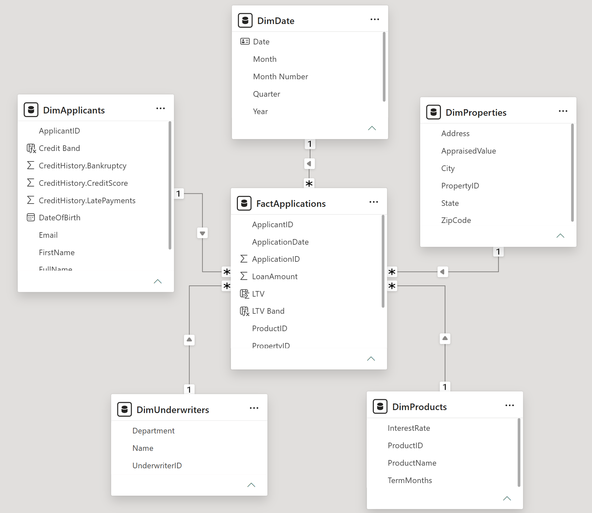
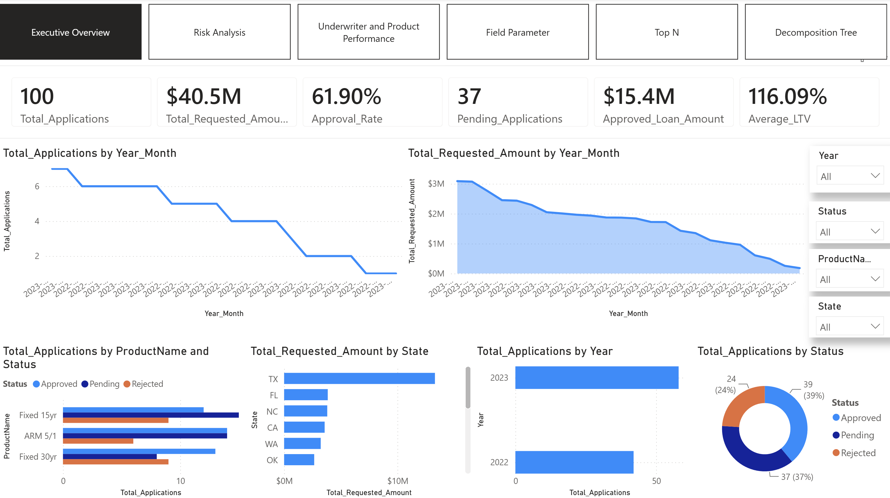
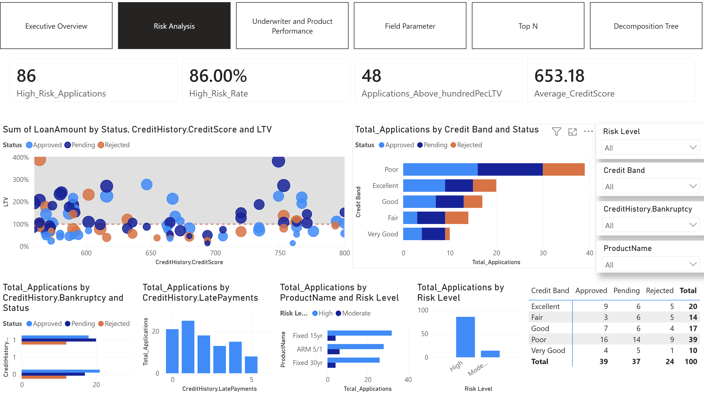
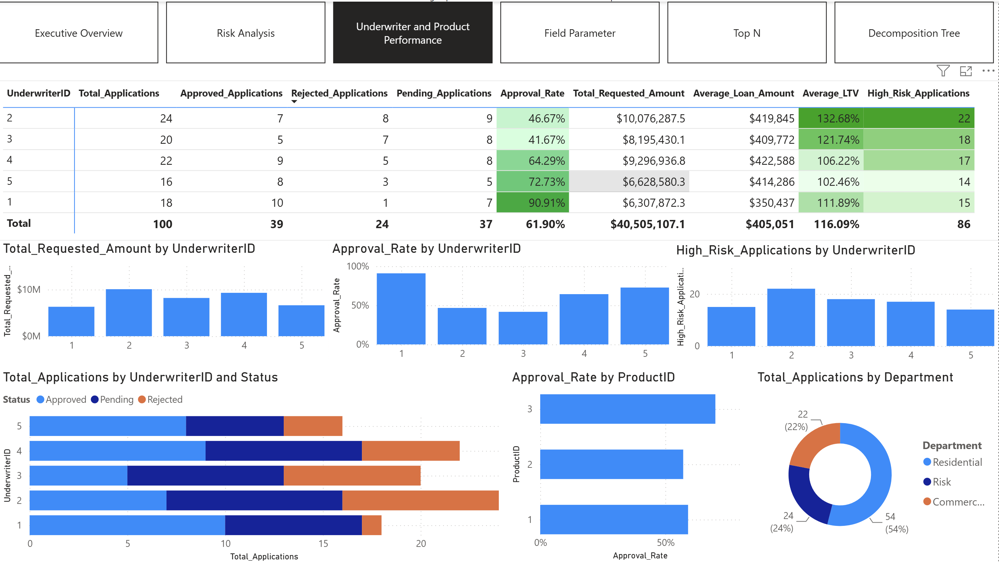
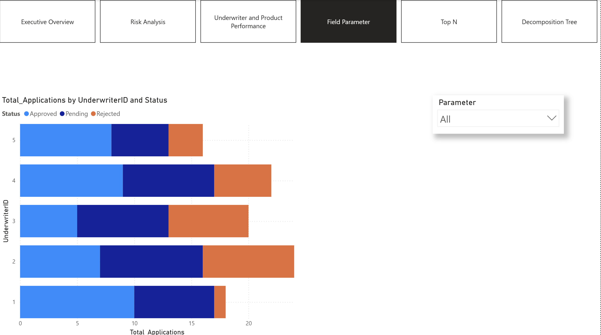
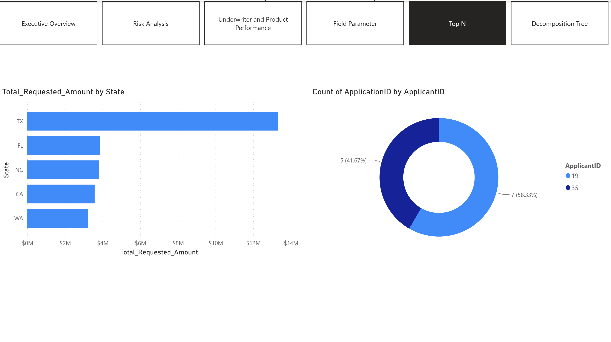
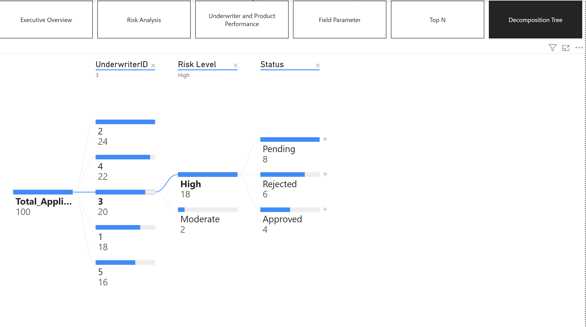

# power-bi-mortgage-loan-dashboard
End-to-end Power BI project for mortgage loan applications, credit risk, approval performance, and underwriter analysis.
# Mortgage Loan Analytics Dashboard

## Project Overview

This project presents an end-to-end Power BI solution for analyzing mortgage loan applications.

The dashboard was designed to help management evaluate application volume, approval and rejection rates, applicant credit risk, loan products, property characteristics, and underwriter performance.

## Business Objectives

- Monitor mortgage loan application trends
- Analyze approval, rejection, and pending rates
- Identify high-risk loan applications
- Evaluate applicants based on credit score and payment history
- Analyze Loan-to-Value (LTV) ratios
- Compare loan product performance
- Evaluate underwriter workload and approval performance
- Identify data quality issues

## Data Sources

The project uses multiple related datasets containing:

- Loan applications
- Applicant information
- Credit history
- Loan products
- Property information
- Underwriter information

## Tools and Technologies

- Power BI
- Power Query
- DAX
- Data Modeling
- Star Schema
- Data Cleaning
- Data Visualization
- Business Intelligence

## Data Preparation

The data preparation process included:

- Importing and combining multiple source files
- Correcting data types
- Cleaning text fields
- Handling duplicate and missing values
- Merging applicant and credit history data
- Validating primary and foreign keys
- Creating a dedicated date table

## Data Model

A star schema was designed with the loan applications table as the central fact table.

## Key Metrics

- Total Applications
- Unique Applicants
- Total Requested Amount
- Average Loan Amount
- Approval Rate
- Rejection Rate
- Pending Rate
- Average LTV
- High-Risk Application Rate
- Average Credit Score
- Applications per Applicant

## Dashboard Pages

### Executive Overview

This page provides a high-level view of mortgage loan applications, requested amounts, approval rates, pending applications, approved loan amounts, and average LTV.

### Risk Analysis

This page analyzes high-risk applications, credit scores, payment history, LTV levels, credit bands, and application status.

### Underwriter and Product Performance

This page evaluates underwriter workload and approval performance while comparing mortgage loan products.

## Advanced Analytics Features

### Dynamic Field Parameter

The Field Parameter allows users to switch dynamically between analytical measures and compare different business metrics.

### Top N Analysis

The Top N page enables users to identify and compare the highest-performing underwriters, products, or geographical segments.

### Decomposition Tree

The Decomposition Tree supports drill-down analysis of mortgage applications and requested amounts across dimensions such as state, product, risk level, credit band, and underwriter.

## Dashboard Features

- Interactive slicers and filters
- Page navigation
- Dynamic KPI cards
- Risk-level segmentation
- Credit score segmentation
- Loan-to-Value analysis
- Underwriter and product performance analysis
- Dynamic Field Parameter
- Top N analysis
- Decomposition Tree
  
## Analytical Questions

The dashboard investigates questions such as:

- Which loan products have the highest approval rates?
- What percentage of applications have an LTV above 100%?
- How does credit score relate to approval rate?
- Which underwriters process the highest number of applications?
- Which applicant segments represent the highest credit risk?
- Are high-risk applications associated with lower approval rates?

## Repository Structure

- `dashboard/`: Screenshots of dashboard pages and advanced analytical features
- `model/`: Star-schema data model
- `powerbi/`: Power BI project file
- `documentation/`: Persian analytical findings and managerial recommendations

## Author

**Armin Khosravi Karchi**

- GitHub: [armin-datasci](https://github.com/armin-datasci)
- Email: thisisarminks@gmail.com
